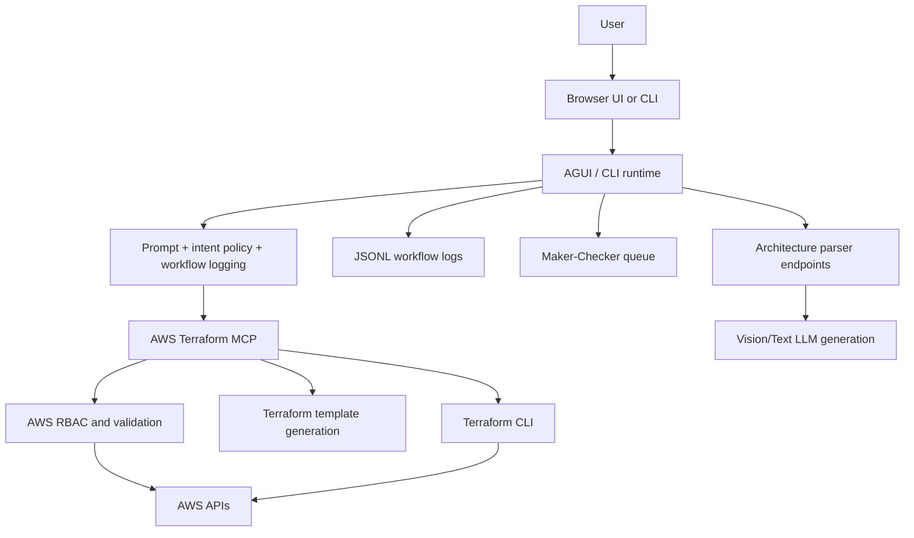

# Application Architecture

This is the concise architecture companion to [SYSTEM_ARCHITECTURE.md](/Users/parag.kulkarni/ai-workspace/aws-infra-agent-bot/docs/SYSTEM_ARCHITECTURE.md). It is meant for quick orientation.

## What The System Is

The repository currently implements a local-first infrastructure operations console with three runtime surfaces:

- `bin/agui_server.py`: primary FastAPI runtime for the browser UI
- `bin/langchain-agent.py`: secondary CLI runtime using the same AWS MCP tool surface
- `deployment/lambda_handler.py`: serverless wrapper for a subset of the agent flow

The AGUI runtime is the most complete implementation. It includes:

- SSE chat streaming
- cloud/MCP selection
- AWS profile-scoped identity
- maker-checker approval flow
- audit trail and CSV export
- architecture parsing endpoints

## The Core Architectural Decision

The central decision in this codebase is to keep conversational orchestration separate from infrastructure execution.

- The LLM decides which tool to call.
- The backend decides whether a tool call is allowed to proceed.
- The MCP server translates allowed actions into AWS-safe operations.
- Terraform performs the durable infrastructure mutation.

That separation is why the design is defensible. The model is not trusted with direct infrastructure side effects.

## Current High-Level Flow

## Nuances That Matter

- AWS is real; Azure is currently a dummy MCP server used to keep the UI and routing model multi-cloud aware.
- Mutating AWS changes are Terraform-only; the older direct CLI mutation mode is intentionally rejected.
- boto3 is still used, but mainly for identity, inventory, permission simulation, cost data, and ECS validation.
- The browser UI is not cosmetic. It is where identity context, approvals, audit, and streamed tool execution are exposed.
- Conversation state is in-memory, while audit state is file-backed JSONL.
- Diagram-driven deployment exists, but it is a secondary workflow beside the main chat runtime.

## Reference Files

- [SYSTEM_ARCHITECTURE.md](/Users/parag.kulkarni/ai-workspace/aws-infra-agent-bot/docs/SYSTEM_ARCHITECTURE.md)
- [functional-architecture.puml](/Users/parag.kulkarni/ai-workspace/aws-infra-agent-bot/diagrams/functional-architecture.puml)
- [terraform-infra-sequence.puml](/Users/parag.kulkarni/ai-workspace/aws-infra-agent-bot/diagrams/terraform-infra-sequence.puml)
- [maker-checker-sequence.puml](/Users/parag.kulkarni/ai-workspace/aws-infra-agent-bot/diagrams/maker-checker-sequence.puml)
