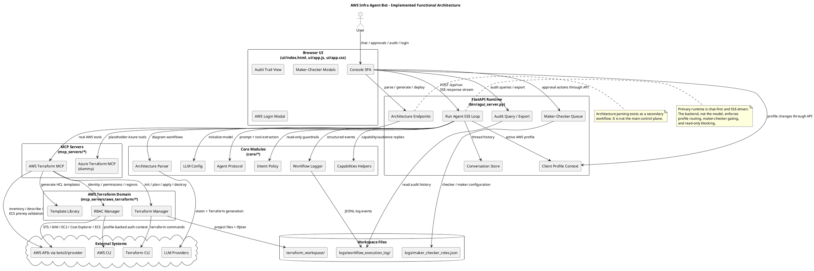
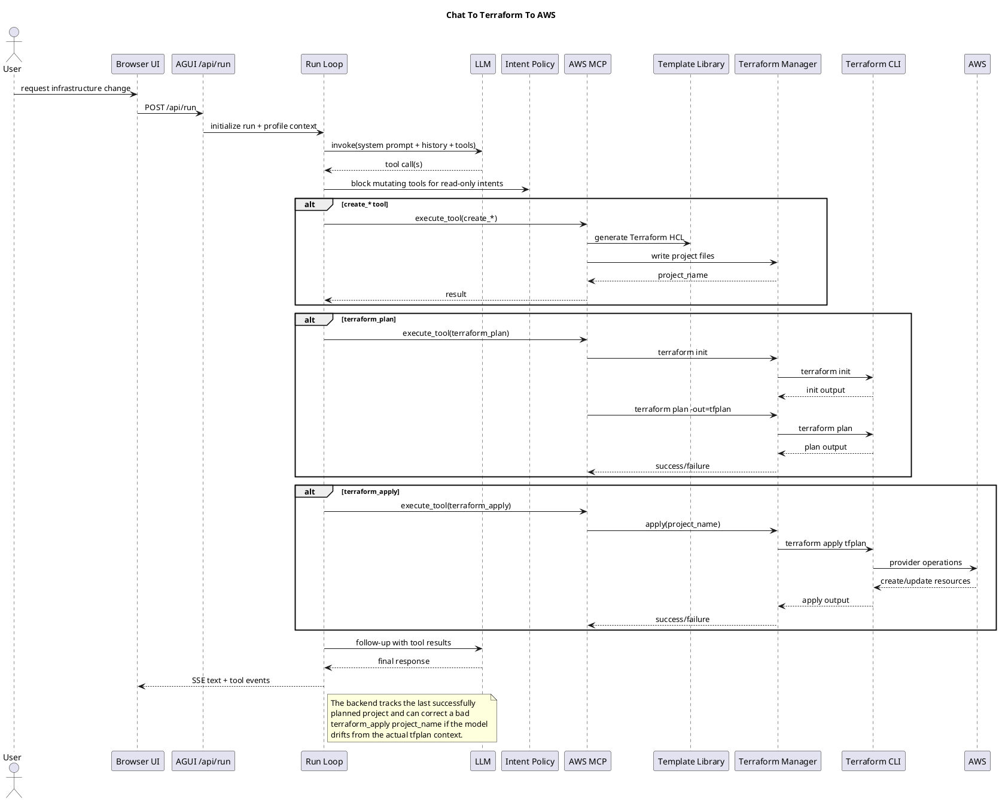
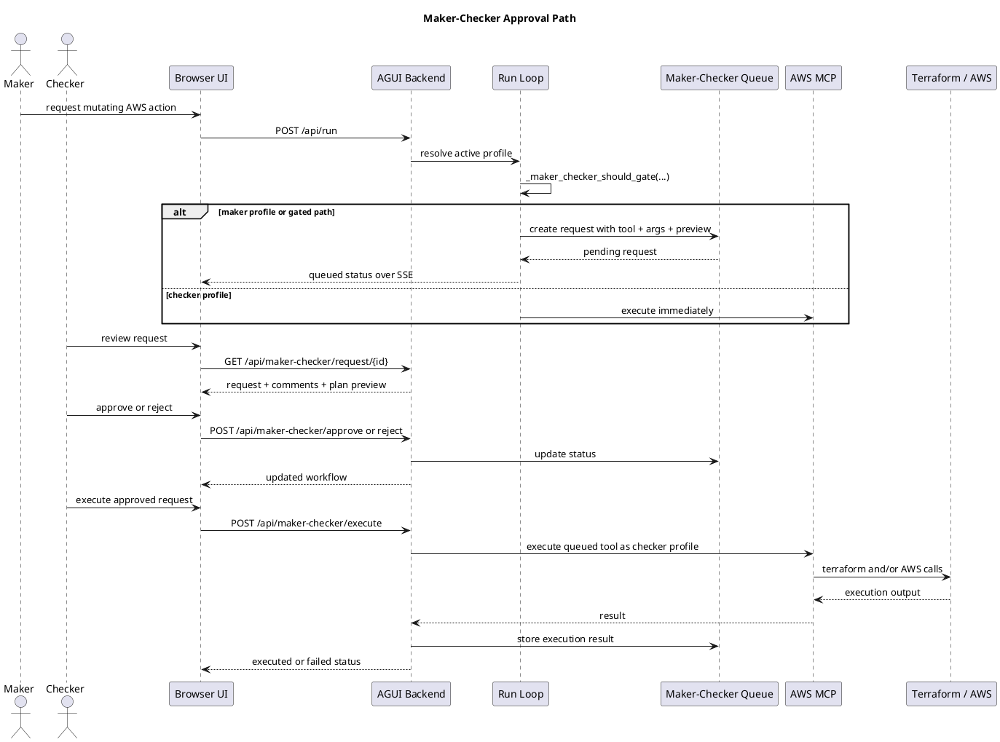
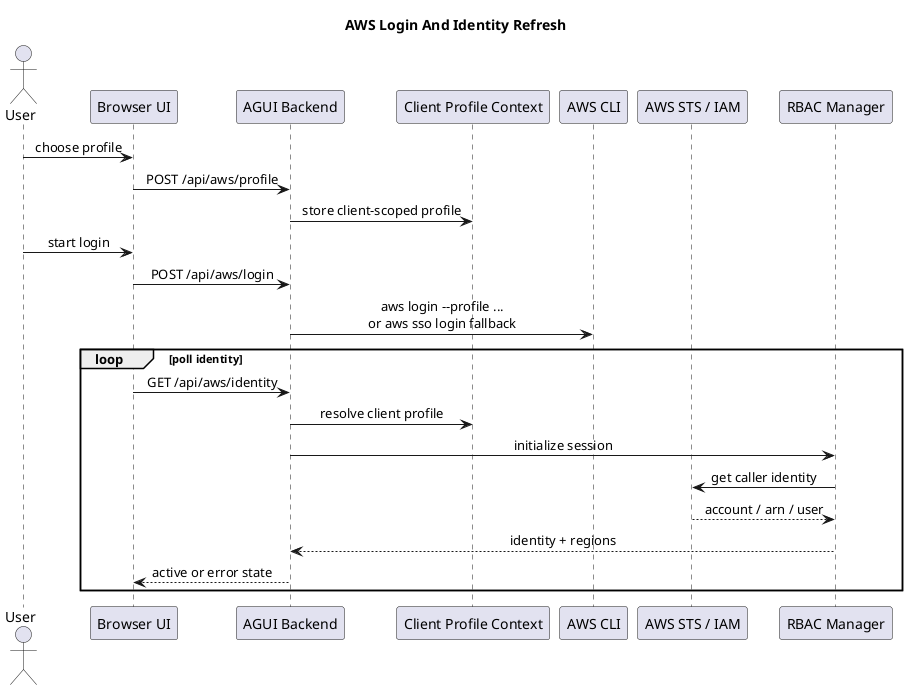

# System Architecture

This document describes the architecture that is actually implemented in the current codebase. It focuses on the runtime paths that matter operationally, the reasons behind the MCP and Terraform choices, and the exceptions or partial implementations that a reviewer is likely to challenge.

## Executive Summary

The system is a chat-first infrastructure operations console. The main runtime is:

1. `ui/index.html` + `ui/app.js` render a single-page console and audit experience.
2. `bin/agui_server.py` exposes FastAPI endpoints for chat, AWS identity, maker-checker, audit export, and architecture parsing.
3. The AGUI runtime invokes an LLM through `core/llm_config.py` and constrains tool usage through `core/agent_protocol.py` and `core/intent_policy.py`.
4. Infrastructure actions are delegated to MCP servers, with AWS as the real implementation and Azure as a dummy placeholder.
5. The AWS MCP server creates Terraform projects, runs `terraform init/plan/apply/destroy`, and uses boto3-based RBAC and validation for identity, region discovery, inventory, and ECS prerequisite checks.
6. Mutating AWS actions can be intercepted by a maker-checker approval queue before execution.
7. Every meaningful step is written to JSONL workflow logs, which are then surfaced in the audit UI and CSV export.

The architecture-to-Terraform endpoints still exist, but they are a secondary workflow. They are not the core user experience anymore.

## Design Intent And Why These Choices Exist

### Why MCP Server Architecture

The code intentionally separates language reasoning from infrastructure execution.

- `bin/agui_server.py` owns conversation state, SSE streaming, profile routing, approval workflow, and audit exposure.
- `mcp_servers/aws_terraform_server.py` owns the tool contract, AWS-specific guardrails, Terraform project generation, and execution semantics.
- `mcp_servers/aws_terraform/*` isolates the domain concerns further into RBAC, Terraform execution, and HCL template generation.

This split was chosen for practical reasons:

- The LLM can be swapped without rewriting infrastructure logic.
- The UI and CLI can reuse the same MCP tool surface.
- Safety controls are enforceable outside the model prompt.
- AWS-specific implementation detail is kept out of the frontend and mostly out of the FastAPI route handlers.
- The same execution backend can be reused by the Lambda entrypoint, even if that path currently lags the AGUI runtime in features.

The important nuance is that this is not a generic academic MCP layer. In this repository, MCP is the boundary where tool schemas, safety gates, AWS validation, Terraform workspace handling, and real cloud side effects meet.

### Why Terraform-Only For AWS Mutation

AWS mutation is intentionally Terraform-only in the current implementation.

- `MCPAWSManagerServer._reject_non_terraform_mode()` explicitly rejects non-Terraform modes.
- `core/agent_protocol.py` pushes the LLM toward `create_* -> terraform_plan -> terraform_apply`.
- `TerraformManager` persists generated projects under `terraform_workspace/` and reuses plan files where available.

This was chosen for safety, auditability, and repeatability:

- Generated infrastructure is materialized as files, not hidden inside opaque imperative API calls.
- `terraform plan` creates an inspectable change boundary before apply.
- Project directories and plan files provide a recoverable operating context after a run completes.
- Maker-checker approval is more defensible when there is a plan preview and stable project name.

The code does still use boto3 heavily, but only where imperative API use is safer or more appropriate than raw Terraform:

- identity and region discovery
- IAM policy simulation / permission introspection
- account inventory and resource description
- ECS preflight validation of subnets, security groups, and IAM roles

That division is intentional: boto3 is used for control-plane inspection and validation; Terraform is used for durable infrastructure mutation.

### Why The UI Is Chat-First

The current UI is not a thin form wrapper around Terraform. It is an operations console built around streaming, approvals, identity context, and auditability.

- `ui/index.html` exposes runtime selection, AWS identity, maker-checker flow, queue review, and audit navigation.
- `ui/app.js` keeps a client-scoped ID, streams `/api/run` responses over SSE, renders tool results, and manages approval workflows.
- `/audit` and `/api/audit/*` turn workflow logs into an operational trail rather than leaving logs buried on disk.

The UI exists because the difficult part of this system is not generating HCL. The difficult part is operating changes safely with human visibility:

- which profile is active
- which cloud backend is selected
- whether a request is read-only or mutating
- whether a maker or checker is issuing the change
- what tool actually ran
- what stdout/stderr came back
- what happened historically across runs

### Why Architecture Parsing Still Exists

`core/architecture_parser.py` and the `/api/architecture/*` endpoints remain because the project still supports diagram-driven workflows:

- parse Mermaid diagrams with regex extraction
- analyze uploaded images with an LLM vision model
- generate Terraform from parsed architecture JSON
- optionally write the generated Terraform into `terraform_workspace/` and run `terraform init/plan`

This is useful, but it is not the most mature or safety-critical path in the repository. The parser is intentionally lightweight on Mermaid parsing and delegates complex infrastructure synthesis to an LLM. Anyone reviewing this should treat it as an accelerator workflow, not the source of truth for the production control plane.

## Implemented Runtime Topology

### Functional Architecture

Reference source: [functional-architecture.puml](/Users/parag.kulkarni/ai-workspace/aws-infra-agent-bot/diagrams/functional-architecture.puml)

## Main AWS Mutation Flow

Reference source: [terraform-infra-sequence.puml](/Users/parag.kulkarni/ai-workspace/aws-infra-agent-bot/diagrams/terraform-infra-sequence.puml)

## Maker-Checker Flow

Reference source: [maker-checker-sequence.puml](/Users/parag.kulkarni/ai-workspace/aws-infra-agent-bot/diagrams/maker-checker-sequence.puml)

## AWS Login And Profile Context

Reference source: [login-sequence.puml](/Users/parag.kulkarni/ai-workspace/aws-infra-agent-bot/diagrams/login-sequence.puml)

## Important Nuances Reviewers Usually Ask About

### The AWS And Azure Backends Are Not Symmetric

AWS is the real execution path. Azure is intentionally a dummy MCP server used to keep the UI and routing model multi-cloud aware while Azure execution is under construction.

That means:

- the dropdown is real
- Azure tool discovery is real
- Azure `terraform_plan` is dummy output
- Azure `terraform_apply` is intentionally unavailable

Any document that presents this system as fully multi-cloud is overstating the current implementation.

### The AGUI Runtime Is More Complete Than The Lambda Runtime

`deployment/lambda_handler.py` reuses the MCP model and intent policy but does not implement the same maker-checker, SSE, audit, or client-profile features as `bin/agui_server.py`.

So the correct interpretation is:

- AGUI is the primary runtime
- CLI is a secondary local operator interface
- Lambda is a deployment wrapper, not the canonical architecture

### Conversation State Is In-Memory

`conversation_store` in `bin/agui_server.py` is an in-memory dictionary keyed by thread ID. This is acceptable for local and single-process operation, but it is not durable multi-instance state. The architecture should be challenged on that point if the deployment target becomes horizontally scaled.

### The Audit Trail Is File-Backed, Not Database-Backed

Audit data comes from JSONL workflow logs under `logs/workflow_execution_log/`, rotated daily with 30 backups. The UI derives audit views from those files and merges in maker-checker lifecycle state. This is pragmatic and simple, but not a substitute for centralized compliance storage in a larger deployment.

### Mermaid Parsing Is Heuristic

`ArchitectureParser.parse_mermaid_diagram()` uses regex extraction and keyword inference rather than a full Mermaid parser. This is fine for structured internal inputs, but it should not be misrepresented as semantically complete diagram parsing.

### Terraform Workspace Is Local Filesystem State

Generated projects live in `terraform_workspace/`. That choice makes debugging easier and approvals more inspectable, but it also means:

- local disk becomes part of the operational state
- state handling and locking remain local unless Terraform backend configuration is added to generated projects
- concurrent multi-user usage on one host needs operational discipline

### RBAC Is Helpful But Not Absolute Enforcement

`AWSRBACManager.check_permission()` uses IAM simulation where possible, but it defaults to permissive behavior if simulation fails. Real enforcement therefore still depends on actual AWS credentials and IAM policy evaluation during runtime. The docs should not claim airtight pre-execution authorization guarantees.

## Architecture-Driven Workflow Positioning

The `/api/architecture/parse-image`, `/api/architecture/parse-mermaid`, `/api/architecture/generate-terraform`, and `/api/architecture/deploy` endpoints are best understood as a parallel workflow:

- parse a diagram or image
- convert it into architecture JSON
- ask an LLM to generate Terraform
- optionally save and plan it in the AWS Terraform workspace

This is valuable for rapid prototyping and diagram-to-IaC experiments, but the stronger operational controls are currently in the chat runtime and maker-checker path.

## Source Map

- Runtime entrypoint: [agui_server.py](/Users/parag.kulkarni/ai-workspace/aws-infra-agent-bot/bin/agui_server.py)
- CLI entrypoint: [langchain-agent.py](/Users/parag.kulkarni/ai-workspace/aws-infra-agent-bot/bin/langchain-agent.py)
- Lambda wrapper: [lambda_handler.py](/Users/parag.kulkarni/ai-workspace/aws-infra-agent-bot/deployment/lambda_handler.py)
- AWS MCP server: [aws_terraform_server.py](/Users/parag.kulkarni/ai-workspace/aws-infra-agent-bot/mcp_servers/aws_terraform_server.py)
- Terraform execution: [terraform.py](/Users/parag.kulkarni/ai-workspace/aws-infra-agent-bot/mcp_servers/aws_terraform/terraform.py)
- AWS RBAC: [rbac.py](/Users/parag.kulkarni/ai-workspace/aws-infra-agent-bot/mcp_servers/aws_terraform/rbac.py)
- Templates: [templates.py](/Users/parag.kulkarni/ai-workspace/aws-infra-agent-bot/mcp_servers/aws_terraform/templates.py)
- Architecture parser: [architecture_parser.py](/Users/parag.kulkarni/ai-workspace/aws-infra-agent-bot/core/architecture_parser.py)
- UI runtime: [app.js](/Users/parag.kulkarni/ai-workspace/aws-infra-agent-bot/ui/app.js)
